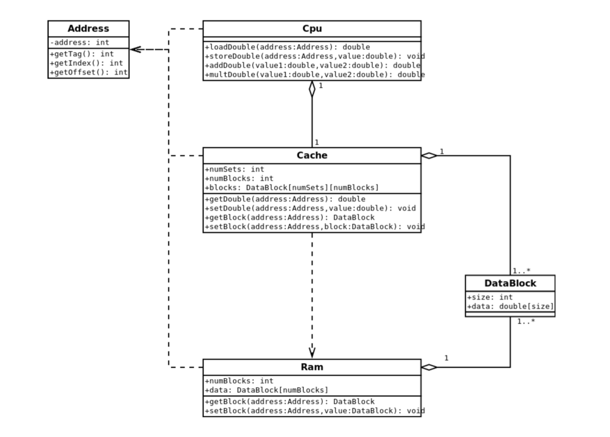

## Architecture


## Compilation and Execution

Compile the program using the following command:

```bash
g++ -O2 cache-sim.cpp -o cache-sim
```
To run the program, use the following command:
```bash
./cache-sim
```
You can specify the following flags:

-c: Cache size in bytes
-b: Size of data block
-n: N-way associativity of cache
-r: Replacement policy
